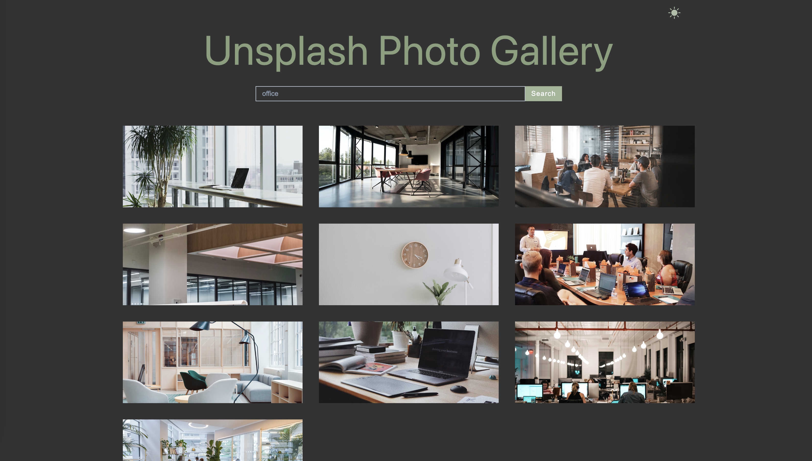

## UnsplashMagic

 `UnsplashMagic` is a dynamic web application that uses the power of the `Unsplash API` to provide an extensive collection of high-quality images for your creative projects. With UnsplashMagic, you can effortlessly search for beautiful visuals to enhance your designs, websites, or social media content.

 The project offers a `dark mode` feature, enhancing the viewing experience and allowing users to personalize their browsing environment.

### The tech stack behind the project
- `JavaScript`
- `React`: A powerful JavaScript library used to build the project:
- - `useState`: Manage state and create a search input state variable
- - `useEffect`: Perform side effects, such as applying dark mode styles based on user preferences
- - `useContext`: Provide and access global context in the application
- `React Query`: A library employed to handle API requests and efficiently manage data fetching
- `React Query Devtools`: Inspect and debug React Query data and caching behavior
- `Axios`: A popular HTTP client library for making API calls

### Discover the website
[UnsplashMagic Website](https://unsplash-magic.netlify.app/)

### Preview
