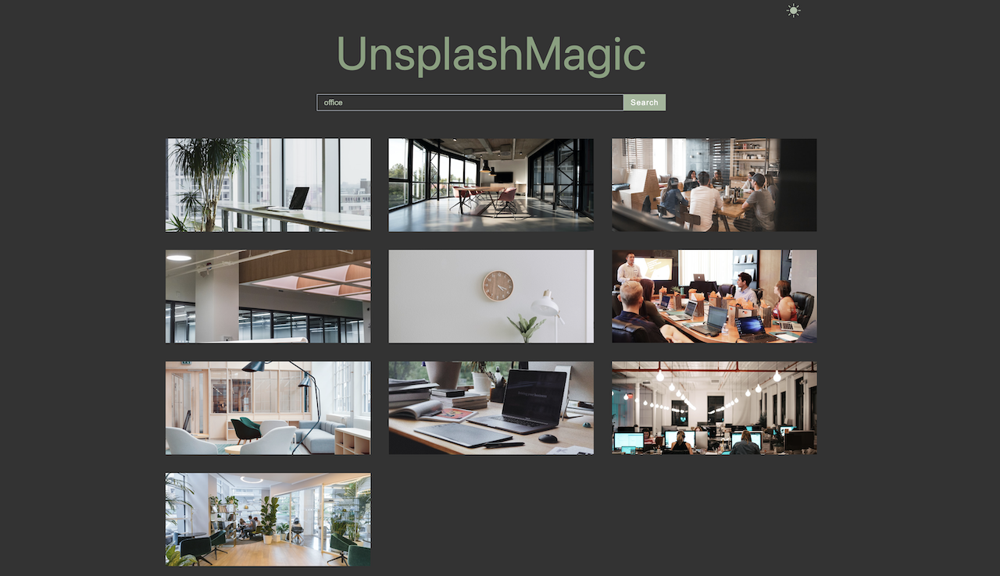

## UnsplashMagic

 `UnsplashMagic` is a dynamic web application that uses the power of the `Unsplash API` to provide an extensive collection of high-quality images for your creative projects. With UnsplashMagic, you can effortlessly search for beautiful visuals to enhance your designs, websites, or social media content.

 The project offers a `dark mode` feature, enhancing the viewing experience and allowing users to personalize their browsing environment.

### The tech stack behind the project
- `JavaScript`
- `React`: JavaScript library used for building the project.
- `React Query` A library employed to handle API requests and efficiently manage data fetching.
- `useState`: A React hook used to manage state and create a state variable for the search input.
- `useEffect`: A React hook used to perform side effects such as applying styles for dark mode based on user preferences.
- `useContext`: A React hook used to provide and access global context in the application.

### Discover the website
[UnsplashMagic Website](https://unsplash-magic.netlify.app/)

### Preview
